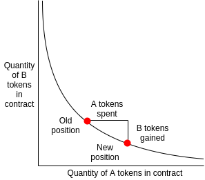

This repository is a Liquidity Module for the Zeedex Exchange.

Liquidity Modules allow to instantly fill orderbooks and bootstrap liquidity with minimal effort. This particular module uses a Constant Product Market Making Model, discussed in greater detail below.

#### Using this repository

This repository is designed to start a market making bot to provide liquidity on Zeedex.

---

# AMM Bots

Automated Market Making (AMM) bots provide liquidity to a marketplace through use of algorithmic market making.

## Running the AMM Bot

This repository is setup to run naturally on the Zeedex Exchange. For use on other marketplaces, you could modify the code snippets below.

### Running from source

```
BOT_TYPE=CONST_PRODUCT \
BOT_PRIVATE_KEY=0x............... \
BOT_BASE_TOKEN=ZDEX \
BOT_QUOTE_TOKEN=USDT \
BOT_BASE_URL=https://bsc-api.zeedex.io/ \
BOT_MIN_PRICE=0.8 \
BOT_MAX_PRICE=1.2 \
BOT_PRICE_GAP=0.02 \
BOT_EXPAND_INVENTORY=7 \
BOT_WEB3_URL=https://bsc-dataseed1.binance.org/ \
go run main.go
```

### Running from a docker image - Recommended and Easy

```
docker run --rm -it \
  -e BOT_TYPE=CONST_PRODUCT \
  -e BOT_PRIVATE_KEY=0x............... \
  -e BOT_BASE_TOKEN=ZDEX \
  -e BOT_QUOTE_TOKEN=USDT \
  -e BOT_BASE_URL=https://bsc-api.zeedex.io/ \
  -e BOT_MIN_PRICE=0.8 \
  -e BOT_MAX_PRICE=1.2 \
  -e BOT_PRICE_GAP=0.02 \
  -e BOT_EXPAND_INVENTORY=7 \
  -e BOT_WEB3_URL=https://bsc-dataseed1.binance.org/ \
  hydroprotocolio/amm-bots
```

To run this container in background just add -d flag

Example -

```
docker run -d --rm -it \
  -e BOT_TYPE=CONST_PRODUCT \
   ............
  .............
```

## Environment Variables

### Basic Variables

- `BOT_TYPE` Type of bot
- `BOT_BASE_URL` Zeedex api base url
- `BOT_WEB3_URL` BSC json rpc url
- `BOT_BASE_TOKEN` Symbol of base token _(e.g ZDEX)_
- `BOT_QUOTE_TOKEN` Symbol of quote token _(e.g USDT)_

### Secret Variables

- `BOT_PRIVATE_KEY` BSC address for place order

## Algorithm Variables

### Constant Product AMM

This bot runs a "constant product market maker model" (popularized in the DeFi community by Uniswap). In short, this model generates a full orderbook based on an initial price for the market. Every transaction that occurs on this market will adjust the prices of the market accordingly. It's a basic supply and demand automated market making system.

- Buying large amounts of the base token will increase the price
- Selling large amounts of the base token will decrease the price

A typical Constant Market Making model has a continuous price curve. This bot discretizes the continuous price curve and creates a number of limit orders to simulate the curve. The order price is limited between `BOT_MAX_PRICE` and `BOT_MIN_PRICE`. The price difference between adjacent orders is `BOT_PRICE_GAP`.


([Image Source](https://medium.com/scalar-capital/uniswap-a-unique-exchange-f4ef44f807bf))

Constant product algorithms have a disadvantage of low inventory utilization. For example, by default it only uses 5% of your inventory when the price increases 10%. `BOT_EXPAND_INVENTORY` can help you add depth near the current price.

- `BOT_MAX_PRICE` Max order price
- `BOT_MIN_PRICE` Min order price
- `BOT_PRICE_GAP` Price difference rate between adjacent orders. For example, ask price increases by 2% and bid price decreases by 2% if `BOT_PRICE_GAP=0.02`.
- `BOT_EXPAND_INVENTORY` Multiply your order sizes linearly. For example, all order sizes will be tripled if `BOT_EXPAND_INVENTORY=3`.

#### Liquidity Sourcing In Constant Product AMM

Constant Product AMM requires a single source of funds for both the base and quote token. As such, the general flow of setting up the AMM bot from scratch is:

- Prepare an address that holds both the BASE and QUOTE token of the trading pair you want to provide liquidity for (We had 1000 USD worth ZDEX -and- 1000 USD worth USDT)
- Set the initial parameters for the bot
  - This determines the initial price, spread, sensitivity, etc.
- Run the bot

Upon running the bot, it will generate an orderbook for your marketplace. The orderbook will appear to be static, but every trade will shift the market accordingly.

#### Further Information On Constant Product AMM

For more information on these models, Scalar Capital provided a [detailed analysis of constant market making](https://medium.com/scalar-capital/uniswap-a-unique-exchange-f4ef44f807bf).

## License

This project is licensed under the Apache 2.0 License - see the [LICENSE](LICENSE) file for details
